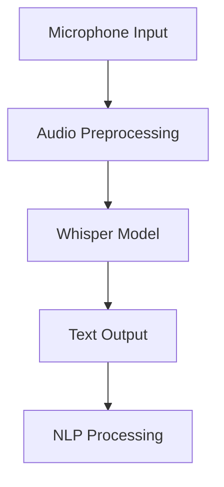

# Capstone Project Architecture

## Overview

This document describes the architecture for the comprehensive capstone project in the Physical AI & Humanoid Robotics Course. The capstone integrates all course concepts into a unified system that demonstrates autonomous humanoid capabilities in simulation.

## System Architecture

### High-Level Architecture

The capstone system consists of several interconnected layers that work together to enable autonomous humanoid behavior:

```
┌─────────────────────────────────────────────────────────────────────────────────────────────────┐
│                                    USER INTERFACE LAYER                                       │
├─────────────────────────────────────────────────────────────────────────────────────────────────┤
│  Voice Commands  │  Natural Language  │  Visual Commands  │  Gesture Recognition  │  GUI      │
└─────────────────────────────────────────────────────────────────────────────────────────────────┘
                                    │
                                    ▼
┌─────────────────────────────────────────────────────────────────────────────────────────────────┐
│                                LANGUAGE UNDERSTANDING LAYER                                  │
├─────────────────────────────────────────────────────────────────────────────────────────────────┤
│  Whisper (Speech-to-Text)  │  LLM Integration  │  Intent Parser  │  Context Manager          │
└─────────────────────────────────────────────────────────────────────────────────────────────────┘
                                    │
                                    ▼
┌─────────────────────────────────────────────────────────────────────────────────────────────────┐
│                                TASK PLANNING LAYER                                            │
├─────────────────────────────────────────────────────────────────────────────────────────────────┤
│  High-Level Planner  │  Task Decomposition  │  Path Planning  │  Manipulation Planning       │
└─────────────────────────────────────────────────────────────────────────────────────────────────┘
                                    │
                                    ▼
┌─────────────────────────────────────────────────────────────────────────────────────────────────┐
│                                PERCEPTION LAYER                                               │
├─────────────────────────────────────────────────────────────────────────────────────────────────┤
│  Vision Processing  │  LIDAR Processing  │  Object Detection  │  Scene Understanding        │
└─────────────────────────────────────────────────────────────────────────────────────────────────┘
                                    │
                                    ▼
┌─────────────────────────────────────────────────────────────────────────────────────────────────┐
│                                CONTROL LAYER                                                  │
├─────────────────────────────────────────────────────────────────────────────────────────────────┤
│  Motion Control  │  Navigation Control  │  Manipulation Control  │  Safety Manager           │
└─────────────────────────────────────────────────────────────────────────────────────────────────┘
                                    │
                                    ▼
┌─────────────────────────────────────────────────────────────────────────────────────────────────┐
│                                SIMULATION/REAL ROBOT                                        │
├─────────────────────────────────────────────────────────────────────────────────────────────────┤
│  Isaac Sim Environment  │  Robot Hardware (Simulation)  │  Sensors & Actuators              │
└─────────────────────────────────────────────────────────────────────────────────────────────────┘
```

### Component Breakdown

#### 1. User Interface Layer
- **Voice Command Interface**: Processes spoken commands using Whisper
- **Natural Language Processor**: Interprets complex language commands
- **Visual Command Interface**: Processes visual cues and gestures
- **GUI Interface**: Provides graphical user interaction options

#### 2. Language Understanding Layer
- **Whisper Integration**: Converts speech to text with high accuracy
- **LLM Integration**: Processes text commands with contextual understanding
- **Intent Parser**: Extracts actionable intents from natural language
- **Context Manager**: Maintains conversation and task context

#### 3. Task Planning Layer
- **High-Level Planner**: Decomposes complex goals into executable tasks
- **Path Planner**: Plans navigation paths through the environment
- **Manipulation Planner**: Plans object manipulation sequences
- **Constraint Checker**: Ensures physical feasibility of plans

#### 4. Perception Layer
- **Vision Processing**: Processes camera and depth sensor data
- **LIDAR Processing**: Analyzes distance measurements for obstacle detection
- **Object Detection**: Identifies and localizes objects in the environment
- **Scene Understanding**: Interprets spatial relationships and affordances

#### 5. Control Layer
- **Motion Control**: Executes low-level motion commands
- **Navigation Control**: Manages path following and obstacle avoidance
- **Manipulation Control**: Controls robotic arms and grippers
- **Safety Manager**: Ensures safe operation at all times

## Detailed Architecture Components

### 1. Language Understanding Module

#### Whisper Speech-to-Text Integration


- **Audio Preprocessing**: Noise reduction and normalization
- **Whisper Model**: Large-scale speech recognition model
- **Text Output**: Transcribed speech with confidence scores
- **NLP Processing**: Natural language processing for command interpretation

#### LLM Integration Architecture


- **LLM Service**: Large Language Model for command interpretation
- **Structured Intent**: Parsed command with parameters
- **Action Sequence**: Sequence of robot actions to execute
- **Task Planner**: Orchestrates complex task execution

### 2. Perception System Architecture

#### Multi-Sensor Fusion
```
┌─────────────────┐    ┌─────────────────┐    ┌─────────────────┐
│   RGB Camera    │    │    LIDAR        │    │      IMU        │
│   (Vision)      │    │   (Range)       │    │   (Inertial)    │
└─────────┬───────┘    └─────────┬───────┘    └─────────┬───────┘
          │                      │                      │
          └──────────────────────┼──────────────────────┘
                                 │
                    ┌────────────▼────────────┐
                    │   Sensor Fusion Node    │
                    │   (Kalman/PF Filter)    │
                    └────────────┬────────────┘
                                 │
                    ┌────────────▼────────────┐
                    │   Environment Model     │
                    │   (Occupancy Grid/3D)   │
                    └─────────────────────────┘
```

- **RGB Camera**: Visual perception and object recognition
- **LIDAR**: Accurate distance measurements and mapping
- **IMU**: Inertial measurements for localization
- **Sensor Fusion**: Combines data from multiple sensors
- **Environment Model**: Unified representation of the world

### 3. Task Planning Architecture

#### Hierarchical Planning System
```
┌─────────────────────────────────────────────────────────────────────────┐
│                        HIGH-LEVEL PLANNER                              │
│  ┌─────────────────────────────────────────────────────────────────┐  │
│  │  Goal: "Bring coffee from kitchen to living room"              │  │
│  └─────────────────────────────────────────────────────────────────┘  │
│                                │                                       │
│  ┌─────────────────────────────────────────────────────────────────┐  │
│  │                    TASK DECOMPOSITION                         │  │
│  │  1. Navigate to kitchen                                        │  │
│  │  2. Locate coffee                                              │  │
│  │  3. Grasp coffee                                               │  │
│  │  4. Navigate to living room                                    │  │
│  │  5. Deliver coffee                                             │  │
│  └─────────────────────────────────────────────────────────────────┘  │
│                                │                                       │
├─────────────────────────────────────────────────────────────────────────┤
│                        MID-LEVEL PLANNER                              │
│  ┌─────────────────┐  ┌─────────────────┐  ┌─────────────────┐       │
│  │  Path Planner   │  │ Manipulation    │  │  Action         │       │
│  │                 │  │  Planner        │  │  Sequencer      │       │
│  │  - Global       │  │  - Grasp poses  │  │  - Execute      │       │
│  │    path planning│  │  - Joint        │  │    action       │       │
│  │  - Local        │  │    trajectories │  │  - Monitor      │       │
│  │    path planning│  │  - Collision    │  │    execution    │       │
│  └─────────────────┘  │    avoidance    │  └─────────────────┘       │
│                       └─────────────────┘                            │
└─────────────────────────────────────────────────────────────────────────┘
```

### 4. Control System Architecture

#### Behavior-Based Control
```
┌─────────────────────────────────────────────────────────────────────────┐
│                          BEHAVIOR ARBITRATION                           │
├─────────────────────────────────────────────────────────────────────────┤
│  ┌─────────────┐  ┌─────────────┐  ┌─────────────┐  ┌─────────────┐  │
│  │ Navigation  │  │ Obstacle    │  │ Manipulation│  │ Safety      │  │
│  │ Behavior    │  │ Avoidance   │  │ Behavior    │  │ Behavior    │  │
│  │             │  │             │  │             │  │             │  │
│  │ - Path      │  │ - Reactive  │  │ - Reach     │  │ - Emergency │  │
│  │   following │  │   avoidance │  │ - Grasp     │  │   stops     │  │
│  │ - Goal      │  │ - Safe      │  │ - Place     │  │ - Collision │  │
│  │   seeking   │  │   navigation│  │ - Handover  │  │   avoidance │  │
│  └─────────────┘  └─────────────┘  └─────────────┘  └─────────────┘  │
│         │              │              │              │                │
│         └──────────────┼──────────────┼──────────────┘                │
│                        │              │                              │
│                        └──────────────┼───────────────────────────────┤
│                                       │                               │
│                        ┌──────────────▼──────────────┐               │
│                        │     Output Arbitration      │               │
│                        │     (Priority/Blending)     │               │
│                        └──────────────┬──────────────┘               │
│                                       │                               │
│                        ┌──────────────▼──────────────┐               │
│                        │    Robot Command Output   │               │
│                        │    (Twist/JointCommands)   │               │
│                        └─────────────────────────────┘               │
└─────────────────────────────────────────────────────────────────────────┘
```

## Integration Patterns

### 1. ROS 2 Communication Architecture

The system uses ROS 2 for inter-component communication:

#### Core Topics
- `/voice_commands` - Input from speech recognition
- `/natural_language_intent` - Parsed commands from LLM
- `/perception/detections` - Object detection results
- `/navigation/goal` - Navigation goals
- `/robot/cmd_vel` - Velocity commands
- `/joint_commands` - Joint position commands
- `/sensor_data` - Raw sensor data

#### Core Services
- `/task_planning/plan` - Request task plans
- `/navigation/get_path` - Request navigation paths
- `/manipulation/grasp` - Request manipulation actions
- `/system/reset` - Reset system state

#### Core Actions
- `/navigate_to_pose` - Navigate to specific pose
- `/execute_task_sequence` - Execute task sequence
- `/manipulation/grasp_object` - Grasp specific object

### 2. Isaac Sim Integration

#### Simulation Architecture
```
┌─────────────────┐    ┌─────────────────┐    ┌─────────────────┐
│   Real Robot    │    │  Isaac Sim      │    │  Isaac ROS      │
│   (Simulation)  │    │  Environment    │    │  Perception     │
│                 │    │                 │    │  & Navigation   │
│  ┌───────────┐  │    │  ┌───────────┐  │    │  ┌───────────┐  │
│  │ Physical  │  │◀──▶│  │ Virtual   │  │◀──▶│  │ Hardware  │  │
│  │ Robot     │  │    │  │ Robot     │  │    │  │ Accelerated │  │
│  │ Model     │  │    │  │ Model     │  │    │  │ Perception  │  │
│  └───────────┘  │    │  └───────────┘  │    │  └───────────┘  │
└─────────────────┘    └─────────────────┘    └─────────────────┘
```

### 3. LLM Integration Architecture

#### Cloud vs Edge Deployment
```
┌─────────────────┐    ┌─────────────────┐    ┌─────────────────┐
│   LLM Service   │    │   Edge Device   │    │   Robot System  │
│   (Cloud/Local) │    │   (Jetson/NPU)  │    │   (On-Device)   │
│                 │    │                 │    │                 │
│  ┌───────────┐  │    │  ┌───────────┐  │    │  ┌───────────┐  │
│  │ Large     │  │    │  │ Smaller   │  │    │  │ Optimized │  │
│  │ Model     │  │    │  │ Model     │  │    │  │ Model     │  │
│  │ (GPT-4,   │  │    │  │ (Local    │  │    │  │ (On-device│  │
│  │  Claude)  │  │    │  │  LLM)     │  │    │  │  LLM)     │  │
│  └───────────┘  │    │  └───────────┘  │    │  └───────────┘  │
└─────────────────┘    └─────────────────┘    └─────────────────┘
         │                       │                       │
         │  Higher quality       │  Moderate quality     │  Lower quality
         │  responses, higher    │  responses, moderate  │  responses, lowest
         │  latency, lower       │  latency, moderate    │  latency, highest
         │  resource usage       │  resource usage       │  resource usage
```

## Safety Architecture

### 1. Safety Layers

The system implements multiple safety layers:

#### Layer 1: Command Validation
- Validates LLM outputs for safety compliance
- Checks action feasibility against robot capabilities
- Verifies environmental constraints

#### Layer 2: Execution Monitoring
- Monitors action execution in real-time
- Detects deviations from expected behavior
- Implements emergency stops when needed

#### Layer 3: Physical Safety
- Collision detection and avoidance
- Force limiting for manipulation
- Safe speed limits for navigation

### 2. Safety Protocols

#### Emergency Procedures
- Immediate stop on safety violation
- Safe posture assumption
- Human operator notification
- System state preservation

#### Recovery Procedures
- Automatic recovery from minor violations
- Escalation to human operator for major issues
- State restoration after safety stops

## Performance Considerations

### 1. Real-time Requirements
- Perception pipeline: < 50ms processing time
- LLM response: < 2000ms for complex commands
- Action execution: < 10ms command latency
- Overall response: < 3000ms from command to action initiation

### 2. Resource Management
- GPU memory: Efficient allocation for Isaac tools
- CPU usage: Balanced between perception and planning
- Network: Low-latency communication for LLM integration
- Storage: Efficient logging and data management

## Scalability Architecture

### 1. Component Modularity
- Well-defined interfaces between components
- Plug-and-play capability for different modules
- Independent development and testing
- Easy replacement of components

### 2. Multi-Robot Support
- Distributed architecture for multiple robots
- Shared environment modeling
- Coordinated task execution
- Resource allocation and conflict resolution

## Development and Deployment Architecture

### 1. Simulation-First Development
- Develop and test in Isaac Sim
- Validate behaviors in safe environment
- Transfer to real hardware when ready
- Iterative improvement cycle

### 2. Container-Based Deployment
- Docker containers for consistent environments
- Kubernetes for orchestration (optional)
- Easy deployment across different platforms
- Versioned and reproducible deployments

## Technology Stack

### Core Technologies
- **ROS 2 Humble**: Robot middleware and communication
- **Isaac Sim**: Physics simulation and synthetic data
- **Isaac ROS**: Hardware-accelerated perception and navigation
- **OpenAI Whisper**: Speech recognition
- **Large Language Models**: Command interpretation
- **Docusaurus**: Documentation and learning platform

### Supporting Technologies
- **Python 3.11**: Primary development language
- **CUDA**: GPU acceleration
- **TensorRT**: Model optimization
- **OpenCV**: Computer vision processing
- **NumPy/SciPy**: Mathematical computations
- **PyTorch**: Deep learning framework

## Quality Assurance Architecture

### 1. Testing Strategy
- Unit tests for individual components
- Integration tests for component combinations
- System tests for end-to-end functionality
- Simulation-to-reality validation

### 2. Monitoring and Logging
- Real-time system monitoring
- Comprehensive logging for debugging
- Performance metrics collection
- Error detection and reporting

## Summary

The capstone project architecture provides a robust, scalable, and safe framework for implementing autonomous humanoid behaviors. The modular design allows for independent development of components while ensuring seamless integration. The safety-first approach ensures reliable operation, while the performance considerations enable real-time execution of complex tasks.

This architecture serves as the foundation for students to implement their own autonomous humanoid systems that demonstrate mastery of all course concepts.