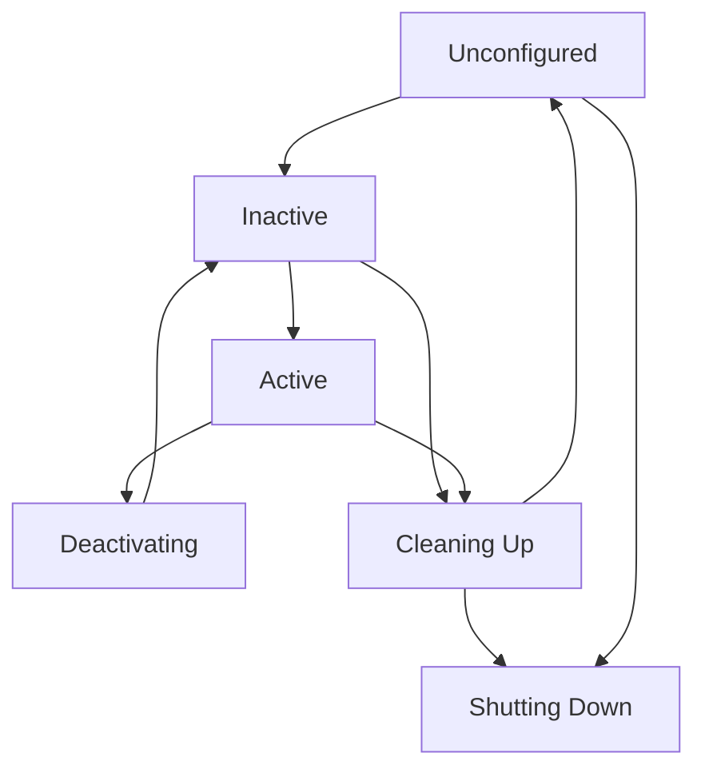

# Nodes, Topics, and Services Architecture

## Introduction

In this section, we'll explore the fundamental building blocks of ROS 2: nodes, topics, and services. These components form the foundation of communication in ROS 2 systems.

## Nodes Architecture

### Node Structure

A ROS 2 node is an executable process that works as part of a ROS 2 system. Each node:

- Implements a portion of the robot's functionality
- Communicates with other nodes through messages
- Can be written in any of the supported languages
- Runs in its own process space

### Node Lifecycle

ROS 2 nodes have a well-defined lifecycle:



### Creating a Node

```python
import rclpy
from rclpy.node import Node

class MinimalPublisher(Node):

    def __init__(self):
        super().__init__('minimal_publisher')
        self.publisher_ = self.create_publisher(String, 'topic', 10)
        timer_period = 0.5  # seconds
        self.timer = self.create_timer(timer_period, self.timer_callback)
        self.i = 0

    def timer_callback(self):
        msg = String()
        msg.data = 'Hello World: %d' % self.i
        self.publisher_.publish(msg)
        self.get_logger().info('Publishing: "%s"' % msg.data)
        self.i += 1
```

## Topics Architecture

### Topic Communication Model

Topics implement a publish-subscribe communication pattern:

- Publishers send messages to topics
- Subscribers receive messages from topics
- Communication is asynchronous
- Many-to-many relationship possible

### Topic QoS Settings

Each topic can have different Quality of Service settings:

- **Reliability Policy**: Reliable vs. Best Effort
- **Durability Policy**: Volatile vs. Transient Local
- **History Policy**: Keep All vs. Keep Last
- **Depth**: Maximum number of messages to store

```python
from rclpy.qos import QoSProfile, ReliabilityPolicy, DurabilityPolicy

# Create a QoS profile with specific settings
qos_profile = QoSProfile(
    depth=10,
    reliability=ReliabilityPolicy.RELIABLE,
    durability=DurabilityPolicy.VOLATILE
)

publisher = node.create_publisher(String, 'topic', qos_profile)
```

### Message Types

ROS 2 uses strongly-typed messages defined in `.msg` files:

```
# std_msgs/String.msg
string data
```

## Services Architecture

### Service Communication Model

Services implement a request-response communication pattern:

- Service Server provides a service
- Service Client sends requests and receives responses
- Communication is synchronous
- One-to-one relationship typically

### Creating a Service Server

```python
import rclpy
from rclpy.node import Node
from example_interfaces.srv import AddTwoInts

class MinimalService(Node):

    def __init__(self):
        super().__init__('minimal_service')
        self.srv = self.create_service(AddTwoInts, 'add_two_ints', self.add_two_ints_callback)

    def add_two_ints_callback(self, request, response):
        response.sum = request.a + request.b
        self.get_logger().info('Incoming request\na: %d b: %d' % (request.a, request.b))
        return response
```

### Creating a Service Client

```python
import rclpy
from rclpy.node import Node
from example_interfaces.srv import AddTwoInts

class MinimalClientAsync(Node):

    def __init__(self):
        super().__init__('minimal_client_async')
        self.cli = self.create_client(AddTwoInts, 'add_two_ints')

        while not self.cli.wait_for_service(timeout_sec=1.0):
            self.get_logger().info('service not available, waiting again...')

        self.req = AddTwoInts.Request()

    def send_request(self, a, b):
        self.req.a = a
        self.req.b = b
        self.future = self.cli.call_async(self.req)
        rclpy.spin_until_future_complete(self, self.future)
        return self.future.result()
```

## Practical Architecture Considerations

### Node Design Patterns

When designing nodes, consider:

1. **Single Responsibility**: Each node should have a clear, single purpose
2. **Loose Coupling**: Minimize dependencies between nodes
3. **High Cohesion**: Group related functionality within a node
4. **Communication Efficiency**: Choose appropriate communication patterns

### Topic Design Guidelines

- Use descriptive names for topics
- Follow namespace conventions
- Consider message frequency and size
- Select appropriate QoS settings for your use case

### Service Design Guidelines

- Use services for synchronous operations
- Consider timeout handling
- Design services with clear, specific interfaces
- Handle errors appropriately

## Best Practices

1. **Naming Conventions**: Use lowercase with underscores (snake_case)
2. **Namespace Organization**: Organize topics and services hierarchically
3. **Error Handling**: Implement proper error handling in all nodes
4. **Logging**: Use appropriate logging levels for debugging
5. **Resource Management**: Properly clean up resources when nodes are destroyed

## Summary

Understanding the architecture of nodes, topics, and services is crucial for effective ROS 2 development. These components form the backbone of all ROS 2 applications and provide the flexibility needed for complex robotic systems.